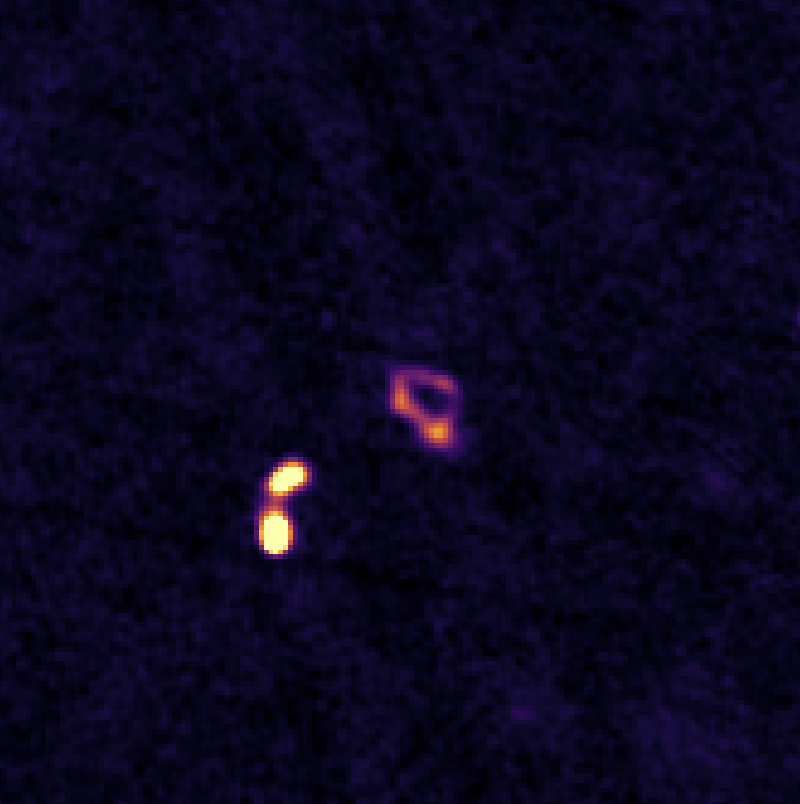
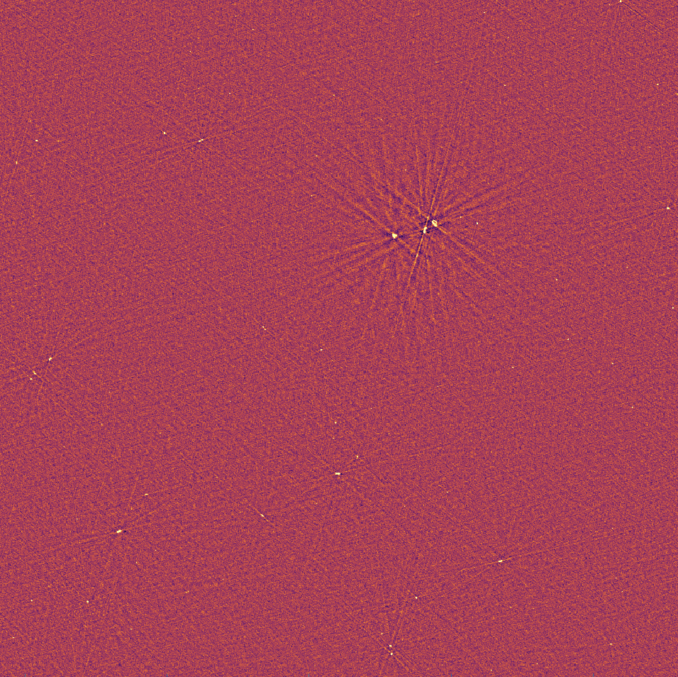
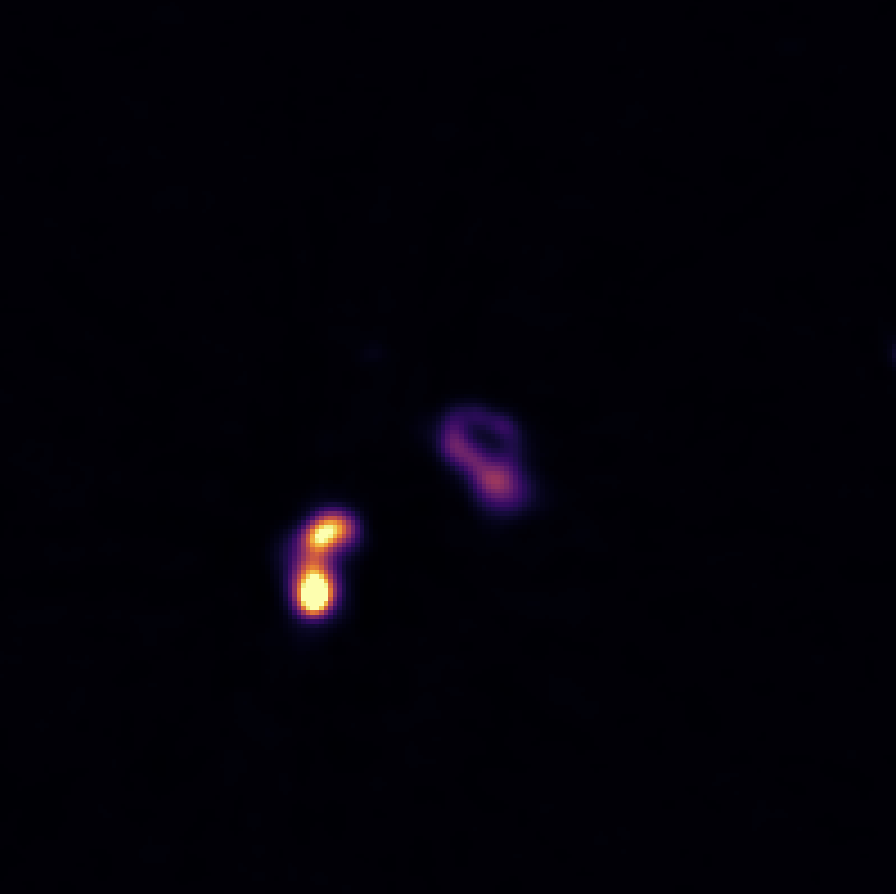

# RadioQuery

RadioQuery is a Python package designed for querying radio survey images such as FIRST and VLASS. This package is organized into survey-specific modules and provides an easy-to-use interface for downloading FITS files.
# Supported Surveys
The current list of surveys currently supported to extract cutouts are the following: 

**The Very Large Array Sky Survey (VLASS) QuickLook:** This is a mixture of single epoch or median over all 3 epochs at 3 GHz thanks to work done by Dillon Dong (Jansky Fellow at NRAO). The list of all fitsfiles used to extract from are available here: https://archive-new.nrao.edu/vlass/quicklook/ql_median_stack/. 


**The FIRST Survey**: These observations are performed at L-band (1.4 GHz) and are obtained via snapshots through https://third.ucllnl.org/cgi-bin/firstcutout. 

**The Lofar Ten-meter Sky Survey:** These observations are performed at ~100 GHz. The snapshots are obtained from DR2 following https://lofar-surveys.org/cutout_api_details.html. 


## Installation

**Clone the Repository:**
   ```bash
   git clone https://github.com/yourusername/radioquery.git
   cd radioquery
   pip install .
```
Note: During installation, the following directories will be created automatically in your home directory:

    ~/RQUERY/FIRST # For FIRST fitsfiles

    ~/RQUERY/VLASS # For VLA Sky Survey fitsfiles

    ~/RQUERY/LOTSS # For Lofar Ten-metre Sky Survey fitsfiles

    ~/RQUERY/tests

The root path can be updated in `setup.py` prior to installation. 
## Requirements

    Python 3.x
    astropy >=6.0.1
    requests
    numpy <2
    pytest


# Example Usage: FIRST Survey
Below is an example of how to use the FirstQuery class from the survey_configs.first module to download a FITS file from the FIRST survey:
```
from astropy.coordinates import SkyCoord 
from radioquery.survey_configs.first import FirstQuery
import os

# Define a target coordinate (ICRS)
coord = SkyCoord(ra='10h50m07.270s', dec='30d40m37.52s', frame='icrs')

# Set the download path (the ~ will be expanded to your home directory)
download_path = os.path.expanduser("~/RQUERY/FIRST")

# Create an instance of FirstQuery with a 5 arcmin image size
fq = FirstQuery(coord=coord, download_path=download_path, size_arcmin=5)

# Download the image and get the file path
file_path,success = fq.download_image()
print("Downloaded FITS file saved at:", file_path)
```

A typical `FIRST` fitsfile is << 1 MB for a 5 arcmin cutout. The script automatically queries https://third.ucllnl.org/cgi-bin/firstcutout and downloads the file to the specified download path. The sample `FITS` file should show something like the following: 



# Example Usage: VLASS
Similar to above, below is an example of querying the NRAO database to download the nearest fitsfile to the specified coordinate. 

**Warning**:Each file is 110 MB large, and corresponds to the median over all epochs (see:https://archive-new.nrao.edu/vlass/quicklook/ql_median_stack/). Unfortunately, no rms file is provided for the median over all epochs. However, it can be expected to be around ~80-120 uJy/beam rms. 

```
from astropy.coordinates import SkyCoord 
from radioquery.survey_configs.vlass import VlassQuery
import os

# Define a target coordinate (ICRS)
coord = SkyCoord(ra='10h50m07.270s', dec='30d40m37.52s', frame='icrs')

# Set the download path (the ~ will be expanded to your home directory)
download_path = os.path.expanduser("~/RQUERY/VLASS")

# Create an instance of VlassQuery 
vq = VlassQuery(coord=coord, download_path=download_path,overwrite=False)
file_path,success = vq.download_image()

print("Downloaded FITS file saved at:", file_path)

```
The sample `FITS` file should show something like the following: 



# Example Usage: LoTSS
Below is an example of how to use the LotssQuery class from the survey_configs.lotss module:
```
from astropy.coordinates import SkyCoord 
from radioquery.survey_configs.first import LotssQuery
import os

# Define a target coordinate (ICRS)
coord = SkyCoord(ra='10h50m07.270s', dec='30d40m37.52s', frame='icrs')

# Set the download path (the ~ will be expanded to your home directory)
download_path = os.path.expanduser("~/RQUERY/LOTSS")

# Create an instance of LotssQuery with a 5 arcmin image size
lq = LotssQuery(coord=coord, download_path=download_path, size_arcmin=5)

# Download the image and get the file path
file_path,success = lq.download_image()
print("Downloaded FITS file saved at:", file_path)
```
Like the other two examples, the sample `FITS` file should show something like the following: 




# Directory Structure
After insallation, the structure of the repository should be the following: 
```graphql
radioquery/
├── radioquery/             
│   ├── __init__.py         
│   ├── survey_configs/
│   │   ├── __init__.py
│   │   ├── first.py
│   │   └── vlass.py 
│   │   └── lotss.py ! Now supported
│   └── utils/
│       ├── __init__.py
│       └── helpers.py
├── setup.py
├── requirements.txt
└── README.md
